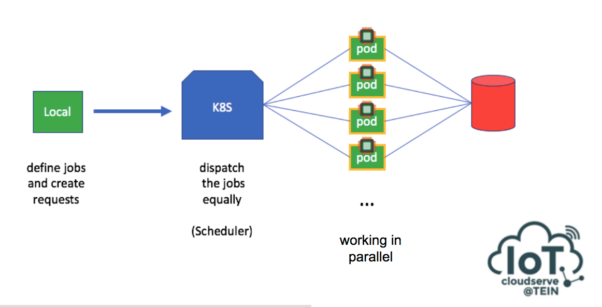

# Cloud-Based Smart Energy Framework for Accelerated Data Analytics with Parallel Computing of Orchestrated Containers: Study Case of CU-BEMS

#### The Simple, Data Wrangling, Data Analytics Framework for IoTCloudserve cluster

Build Powerful, Scalable parallel computing on simple way

### CU-BEMS
- [Introduction](#CU-BEMS)

### Slide
- [Click here](https://docs.google.com/presentation/d/1yy1qVb0cMnAoSeVzh2FzEMdeQIlxewvcOxJQ7VJUWvU/edit?usp=sharing)


### Resources and References
- [Energy Research Data (Smart Grid Research Unit, Chulalongkorn University)](https://sgrudata.github.io/)
- [CU-BEMS](https://www.bems.chula.ac.th/)
- [Research - CU-BEMS, smart building electricity consumption and indoor environmental sensor datasets](https://www.nature.com/articles/s41597-020-00582-3)

## CU-BEMS

“Data-centric IoT-cloud service platform for smart communities” or IoTcloudServe@TEIN project has been established since 20 June 2018. The main purpose of this project is to integrate networked collaborative efforts of research and educational communities from developed-countries (Korea, Japan), from another developing country (Malaysia), and from a least developed country (Laos) `1`. In the project, we should like to achieve a framework design and a proof-ofconcept implementation for a data-centric IoT-cloud platform that can help enable IoT-domain service diversification. As an example for IoT-domain service demonstration, herein, the focus is concerned with the IoTcloudServe@TEIN’s SmartEnergy@Chula service based on the earlier completed socalled CU-BEMS (Chulalongkorn University’s Building Energy Management System) testbed.

CU-BEMS, with the technical support of CU-BEMS IEEE1888 protocol server engine from the University of Tokyo `2` `3`, is readily available with more than 250 energy-related sensors `4` `5` and smart meters `6` that send the real-time energy and room ambient readings to CU-BEMS storage. With
the total data generation rate up to 800 data points in every second, the design of CU-BEMS is to monitor, control and analyze actual energy consumption profiles as well as relevant building’s ambient environments. The main goal is not only to show site energy management automation in engineering
department buildings but also to raise people awareness `7`; for example; a smart meter records energy usage of airconditioning systems inside a room and motion sensors in that area check the people movement. If no motion is detected in that room, then the CU-BEMS will alarm the waste energy
usage of the air-conditioning system for energy saving. For information-pushing model design in CU-BEMS, the testbed provides Interactive Display as a Service (IDaaS) to notify to building users the real-time energy-related information to create awareness to staffs and students inside campus `8`.

- `1` IoTcloudServe@TEIN, 2018, Facebook about, viewed August 2018, https://www.facebook.com/iotcloudserve/
- `2` Ochiai, H. , Ishiyama, M., Momose, T., Fujiwara, N., Ito, K., Inagaki, H., Nakagawa, A. and Esaki, H. FIAP: Facility Information Access Protocol for Data-Centric Building Automation Systems. in IEEE INFOCOM M2MCN workshop, 2011
- `3` IEEE1888-2011: IEEE Standard for Ubiquitous Green Community Control Network, 2011.
- `4` Inthasut, T. and Aswakul, C. ZigBee Wireless Sensor Network with IEEE1888 Gateway for Building Energy Management System. Proceedings of ICEIC 2014, Kota Kinabalu, Malaysia : 2014.
- `5` Inthasut, T. and Aswakul, C. Development and Reliability Testing of IEEE1888 Gateway for ZigBee Wireless Sensor Network in Chulalongkorn University’s Building Energy Management System. Proceedings of ISIPS 2014, Fukuoka, Japan, 13 November 2014. (Excellent Paper Award).
- `6` Le, D. H. and Pora, W. Development of smart meter for building energy management system based on the IEEE 1888 standard with Wi-Fi communication. In Proceedings of ICEIC 2014, Kota Kinabalu, Malaysia, January 2014.
- `7` Khawsa-ard, P. and Aswakul, C. Application of simple computer board game with gesture sensor input for increasing awareness in electrical energy consumption. ITC-CSCC 2014, 2014.
- `8` Khawsa-ard, P. and Aswakul, C. IEEE1888 interactive display as a service (IDaaS): Example in building energy management system. COMPSAC 2015, 2015.

## Acknowledgement

CU-BEMS designed & built by Chula-EE core faculty team members and 30+ BEng/MEng students at Chula-EE since 2013 with various international collaborations and main financial support from Energy Conservation Promotion Fund (ENCON Fund), under the Energy Policy and Planning Office (EPPO), Ministry of Energy

## CU-BEMS DESIGN PRINCIPLES

Protocol/Information: Proprietary/Closed =>  `Open/Sharing`

Information Visualization: Pull Type => `Push Type`

Demand Control: Centralized/Top Down => `Decentralized/Bottom Up (Self-Awareness/User Participation)`

Vendor Oriented (Dependency) => `User Oriented (Freedom)`

## Design Concept - Working with mountains of data


Ref: Data Wrangling with JavaScript Book by Ashley Davis



## index.js


```javascript
const Hapi = require('@hapi/hapi');
const fs = require('fs');

const init = async () => {

    const server = Hapi.server({
        port: 8080
    });

    const Glob = require('glob');

    await server.register(Glob.sync("./modules/**/*.js").map((js) => require(js)));

    server.route([
        {
            method: 'GET',
            path: '/listfiles',
            handler: (request, h) => {
                try {
                    files = []
                    fs.readdirSync('./csv/').forEach(file => files.push(file))
                    return files
                } catch (e) {
                    return e.message
                }

            }
        },
        {
            method: 'GET',
            path: '/csv/{name}',
            handler: async (request, h) => {
                try {
                    n = 0
                    sum = 0
                    stream = fs.createReadStream(__dirname + '/csv/' + request.params.name)

                    return await new Promise((resolve, reject) => {
                        parse = require('csv-parse')
                        parser = parse({ delimiter: ',', columns: true })
                        parser.on('readable', () => {
                            while (record = parser.read()) {
                                n++
                                for (var name in record) {
                                    if (name.indexOf("VALUE") != -1) sum += parseFloat(record[name]) || 0;
                                }
                            }
                        })
                        parser.on('error', (error) => reject(error.message))
                        parser.on('finish', () => {
                            result = {
                                n: n, sum: sum, name: request.params.name
                            }
                            resolve(result)
                        })
                        stream.pipe(parser)
                    })
                } catch (e) {
                    return e.message
                }
            }
        }
    ]);

    await server.start();
    console.log('Server running on %s', server.info.uri);
};

process.on('unhandledRejection', (err) => {
    console.log(err);
    process.exit(1);
});

init();
```

## local.js


```javascript

const listfile = [
    ["0", "eng4", "fl13", "north", "lab_tsrl_dsprl_emrl", "z1", "aircon_3ph1", "monitor", "energy_r"],
    ["1", "eng4", "fl13", "north", "lab_tsrl_dsprl_emrl", "z1", "aircon_3ph1", "monitor", "energy_s"],
    ["2", "eng4", "fl13", "north", "lab_tsrl_dsprl_emrl", "z1", "aircon_3ph1", "monitor", "energy_t"],
    ["3", "eng4", "fl13", "north", "lab_tsrl_dsprl_emrl", "z1", "light1", "monitor", "energy"],
    ["4", "eng4", "fl13", "north", "lab_tsrl_dsprl_emrl", "z1", "outlet1", "monitor", "energy"],
    ["5", "eng4", "fl13", "north", "lab_tsrl_dsprl_emrl", "z1", "sensor1", "monitor", "humidity"],
    ["6", "eng4", "fl13", "north", "lab_tsrl_dsprl_emrl", "z1", "sensor1", "monitor", "illuminance"],
    ["7", "eng4", "fl13", "north", "lab_tsrl_dsprl_emrl", "z1", "sensor1", "monitor", "pir"],
    ["8", "eng4", "fl13", "north", "lab_tsrl_dsprl_emrl", "z1", "sensor1", "monitor", "temperature"],
    // Point id data...
}

let zonepirlist = []
let energylist = []
let zoneenergy = {}

for (const each of listfile) {
    if (each[each.length - 1] == "pir") {
        const zone = each[1]+"-"+each[2]+"-"+each[3]+"-"+each[4]+"-"+each[5];
        zonepirlist.push(zone)
        zoneenergy[zone] = {
            pir: each[0],
            energy: []
        }
    }
}

for (const each of listfile) {
    if (each[each.length - 1] == "energy") {
        const zone = each[1]+"-"+each[2]+"-"+each[3]+"-"+each[4]+"-"+each[5];
        if (zonepirlist.includes(zone)) {
            energylist.push(each)
            if (each[each.length - 1] == "energy" && each[6].indexOf("aircon") != -1)
                zoneenergy[zone]["energy"].push(each[0])
        }
    }
}

let jobs = []

for (const eachzone in zoneenergy) {
    for (const pointid of zoneenergy[eachzone]["energy"]) {
        const job = {
            pirpointid: zoneenergy[eachzone]["pir"],
            energypointid: pointid
        }
        jobs.push(job)
    }
}

const Wreck = require('@hapi/wreck');

let path = 'http://newwebserver.parallelcomputingdemo.161.200.90.106.xip.io';
// let path = 'http://localhost:8080'

let main = async () => {

    let laps = []
    const parallel = 25
    const maxlap = 4
    console.log(jobs.length);
    while (jobs.length > 0) laps.push(jobs.splice(0, parallel))
    laps = laps.splice(0, maxlap)

    let result = []

    const executejob = (pir, energy) => {
        return Wreck
            .get(path + `/csv/${pir}.csv/${energy}.csv`, { json: true })
            .then((res) => res.payload)
            .then((res) => {
                return {
                    "allenergy": parseFloat(res.allenergy),
                    "wastedenergy": parseFloat(res.wastedenergy),
                    "usefulenergy": parseFloat(res.usefulenergy)
                }
            })
            .catch((e) => console.log("Error: " + e.message))
    }

    n = 0

    while (laps.length > 0) {
        n++
        lap = laps.shift()
        lapresult = await Promise.all(lap.map((job) => executejob(job.pirpointid, job.energypointid)))
        result = result.concat(lapresult);
        console.log(n);
        console.log(lapresult);
    }

    let summarize = {
        allenergy: 0,
        wastedenergy: 0,
        usefulenergy: 0
    }


    result.map((res) => {
        summarize.allenergy += res.allenergy
        summarize.wastedenergy += res.wastedenergy
        summarize.usefulenergy += res.usefulenergy
    })

    console.log(summarize);
}

main();
```